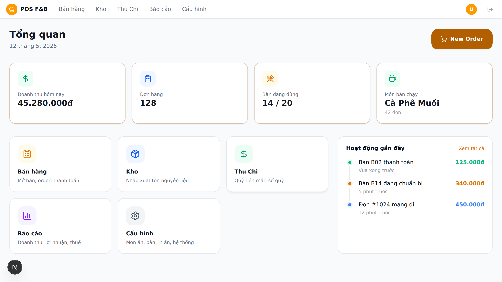
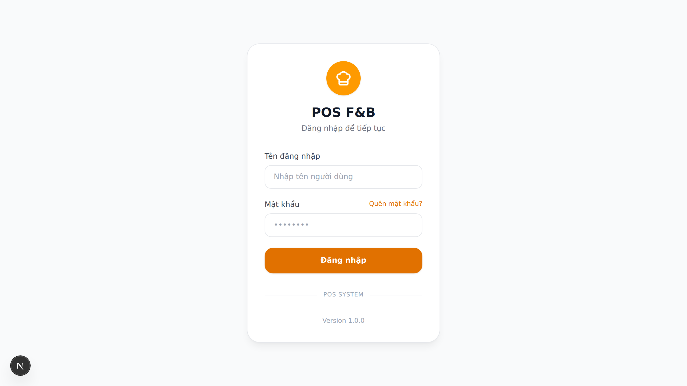
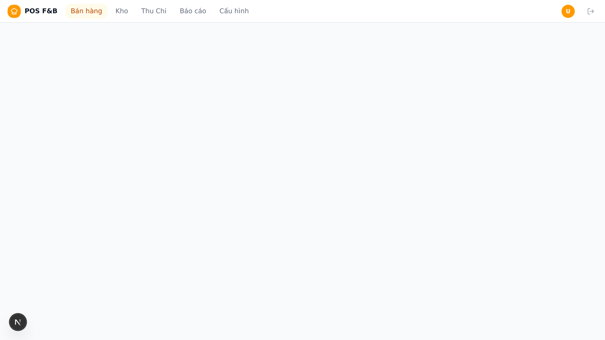
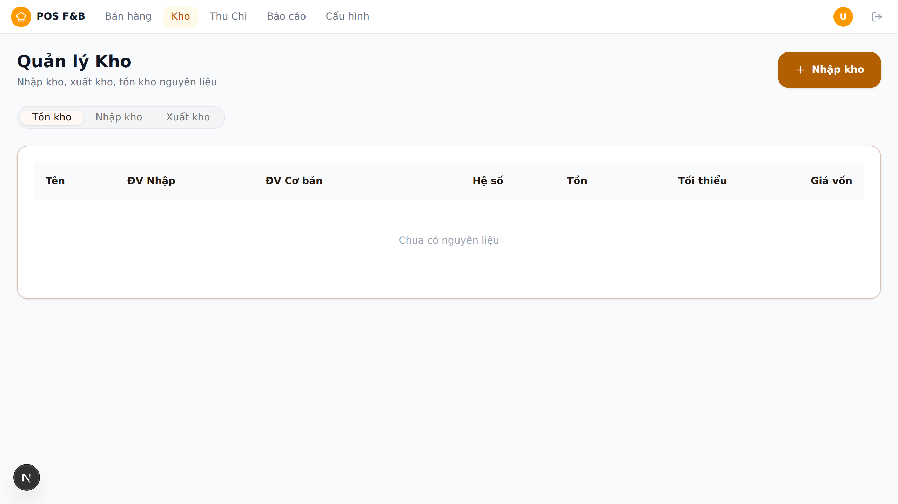
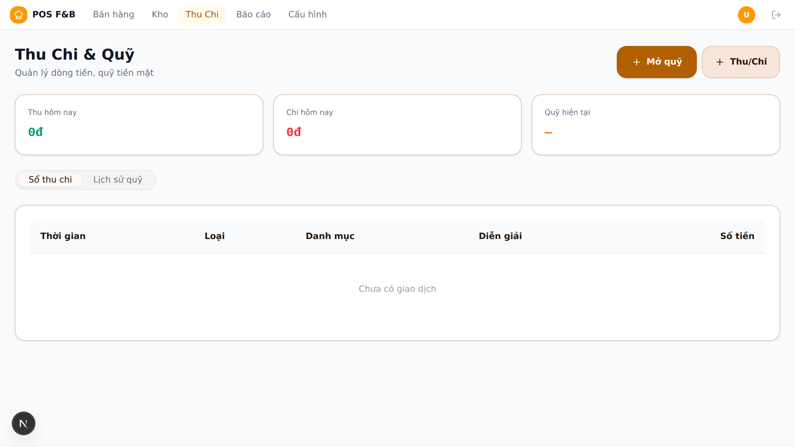
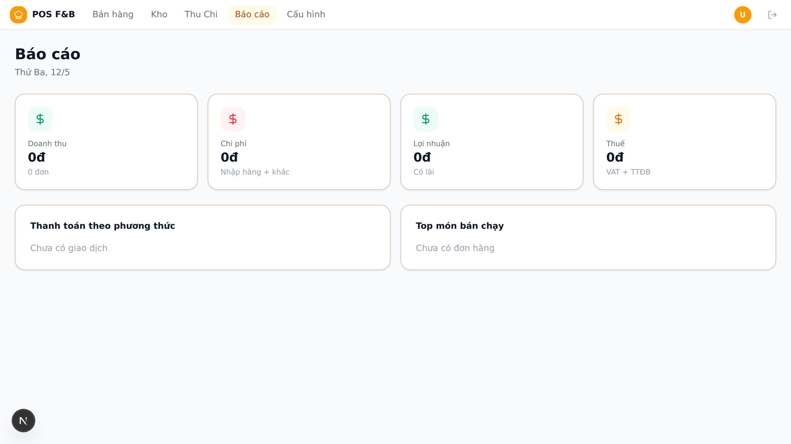

<p align="center">
  
</p>

<h1 align="center">🍜 POS-F&B</h1>
<p align="center"><strong>Open-source Point of Sale for Restaurants, Cafés & Karaoke</strong></p>

<p align="center">
  
  
  
  
  
</p>

---

## ✨ What is POS-F&B?

POS-F&B is a **complete restaurant management system** built with Next.js. It handles everything from table orders and kitchen printing to inventory, cash flow, and business reports — all in one app.

> 🎯 Born from real restaurant needs in Vietnam. Ready for the world.

### 📸 Screenshots

| Login | Dashboard | Order |
|-------|-----------|-------|
|  |  |  |

| Inventory | Cash | Reports |
|-----------|------|---------|
|  |  |  |

---

## 🚀 Features

### 🧾 Order Management
- **Table grid view** — drag & drop tables by area (Restaurant, Karaoke, Takeaway)
- **Open / Merge / Split tables** with guest count tracking
- **Product catalog** with categories, toppings, VAT, excise tax
- **Send to kitchen** — prints kitchen tickets (order items only, no price)
- **Pre-bill** & **Checkout** with multiple payment methods (cash, transfer, Momo, etc.)
- **Discounts** (% or fixed), **service charges**, happy hour, holiday surcharges

### 📦 Inventory & Stock
- **Stock In / Stock Out** tracking with suppliers
- **Unit conversion** (purchase unit ↔ base unit)
- **Recipe-based usage** — auto-deduct ingredients per dish sold
- **Low stock alerts** with min-stock thresholds

### 💰 Cash Flow
- **Cash register** — open/close shift with opening/closing balance
- **Income & Expense** tracking by category
- **Discrepancy detection** (expected vs actual)

### 📊 Reports & Excel Export
- **Revenue Report** — by day, payment method, expense category
- **Ingredient Report** — stock in/out detail, supplier breakdown
- **Warehouse Report** — current stock overview, low stock alerts
- **Sold Items Report** — top-selling products
- **Invoice Report** — all transaction history
- **Export to Excel** — all reports downloadable as .xlsx

### 🖨️ Dual-Mode Printing
- **Server Mode** — server sends TCP directly to thermal printers (for local networks)
- **Client Mode** — server builds content, device prints via WiFi/Bluetooth/USB (for cloud deployments)
- **Visual Template Editor** — drag & drop toggle for header/body/footer fields
- **Separate ORDER vs BILL templates** — kitchen tickets show only items×qty (no money); bills show full header/footer with prices

### 🌐 Multi-Language (i18n)
- 🇻🇳 Tiếng Việt | 🇬🇧 English | 🇨🇳 中文 | 🇰🇷 한국어 | 🇯🇵 日本語
- Switch language from header or login page
- LocalStorage persistence

### ⚙️ System Modules
- Toggle individual modules on/off (Orders, Inventory, Reports, Karaoke, KDS)
- Disabled modules are hidden from the sidebar menu

### 🔐 Auth & Roles
- NextAuth.js with credential provider
- Role-based access control (Admin, Staff, etc.)
- Custom permission JSON per role

---

## 🛠 Tech Stack

| Layer | Technology |
|-------|-----------|
| **Framework** | [Next.js 16](https://nextjs.org/) (App Router, Turbopack) |
| **Language** | TypeScript |
| **Database** | SQLite via [Prisma](https://www.prisma.io/) |
| **Auth** | [NextAuth.js](https://next-auth.js.org/) v5 (Credentials) |
| **UI** | [shadcn/ui](https://ui.shadcn.com/) + Tailwind CSS |
| **Icons** | [Lucide](https://lucide.dev/) |
| **Excel Export** | [ExcelJS](https://github.com/exceljs/exceljs) |
| **PDF/Screenshots** | Puppeteer |
| **Charts** | Recharts |
| **Toast** | Sonner |
| **i18n** | Custom context + provider (5 languages) |
| **Printing** | TCP sockets (server) / Web Bluetooth API (client) |
| **Package Manager** | npm |

---

## 📦 Quick Start

### Prerequisites
- **Node.js** 20+ and **npm**

### 1. Clone & Install
```bash
git clone https://github.com/datnguyen/pos-fnb.git
cd pos-fnb
npm install
```

### 2. Environment Setup
```bash
cp .env.example .env.local
# Edit .env.local with your values:
#   AUTH_SECRET = any random string (openssl rand -base64 32)
#   AUTH_URL   = http://localhost:3000
```

### 3. Database Setup
```bash
npx prisma migrate dev --name init
npx prisma db seed   # Creates default admin account + sample data
```

### 4. Run
```bash
npm run dev           # Development (Turbopack)
# OR
npm run build && npm start   # Production
```

Open **http://localhost:3000** — default login: `admin` / `admin123`

---

## 🚢 Production Deployment

```bash
# Build
npm run build

# Start with PM2
pm2 start npm --name pos-fnb -- start
pm2 save
```

For HTTPS, use a reverse proxy (nginx, Caddy, Cloudflare Tunnel).

### Printer Setup
- **Local network**: Set printer mode to "Server" → enter IP & port of your thermal printer
- **Cloud / Mobile**: Set printer mode to "Device" → print from phone browser via Bluetooth/WiFi

---

## 📁 Project Structure

```
pos-fnb/
├── prisma/
│   ├── schema.prisma        # Database schema (40+ models)
│   ├── seed.ts              # Seed data (sample menu, accounts)
│   └── migrations/
├── src/
│   ├── app/
│   │   ├── (auth)/login/    # Login page
│   │   └── (pos)/
│   │       ├── dashboard/    # Dashboard with stats & timeline
│   │       ├── order/        # Table management & ordering
│   │       ├── inventory/    # Stock in/out & tracking
│   │       ├── cash/         # Cash register & flow
│   │       ├── reports/      # 5 report types + Excel export
│   │       └── settings/     # 20+ config pages
│   ├── server/              # Server actions (Prisma queries)
│   ├── i18n/                # 5-language dictionaries
│   ├── hooks/               # React hooks (useBluetoothPrinter)
│   ├── components/ui/       # shadcn/ui components
│   └── lib/                 # Utilities (db, auth, utils)
├── screenshots/             # App screenshots
├── docs/                    # User guides
└── public/                  # Static assets
```

---

## 🌍 Internationalization

POS-F&B supports 5 languages out of the box:

| Language | Code | Coverage |
|----------|------|----------|
| 🇻🇳 Tiếng Việt | `vi` | 100% (reference) |
| 🇬🇧 English | `en` | 100% |
| 🇨🇳 中文 | `zh` | 100% |
| 🇰🇷 한국어 | `ko` | 100% |
| 🇯🇵 日本語 | `ja` | 100% |

To add a new language: copy `src/i18n/vi.ts` → translate values → register in `src/i18n/dictionaries.ts`.

---

## 🤝 Contributing

Contributions are welcome! Here's how:

1. Fork the repo
2. Create a branch: `git checkout -b feature/amazing-feature`
3. Commit: `git commit -m "Add amazing feature"`
4. Push: `git push origin feature/amazing-feature`
5. Open a Pull Request

### What we need help with
- Translations for more languages
- Payment gateway integrations (VNPay, Stripe, PayPal)
- Receipt printer ESC/POS protocol improvements
- Unit & E2E tests

---

## 📝 Changelog

See [CHANGELOG.md](CHANGELOG.md) for version history.

---

## 👥 Authors

- **Công Tử** — Product owner, domain expertise
- **Mập 🐼** — AI assistant, development & maintenance

---

## 📄 License

MIT — see [LICENSE](LICENSE) for details. Free for personal and commercial use.

---

<p align="center">
  <sub>Built with ☕ and 🍜 by restaurant people, for restaurant people.</sub>
</p>
